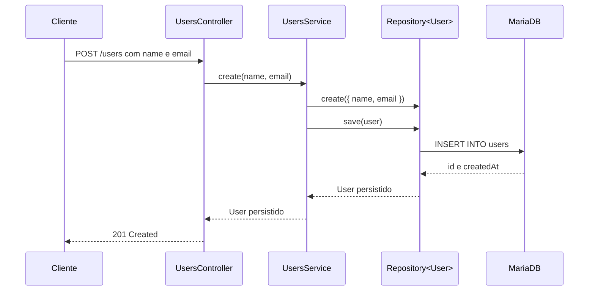

# Arquitetura da aplicação

Este documento descreve a organização arquitetural do projeto NestJS com
TypeORM e MariaDB.

## 1. Visão geral

A aplicação é organizada por módulos e recursos:

```text
src/
├── main.ts
├── app.module.ts
└── users/
    ├── user.entity.ts
    ├── users.controller.ts
    ├── users.service.ts
    └── users.module.ts
```

O projeto segue uma arquitetura em camadas simples:

```text
HTTP -> Controller -> Service -> Repository -> Database
```

## 2. Organização por módulos

Cada módulo representa uma funcionalidade coesa.

No projeto, `UsersModule` agrupa:

- `UsersController`.
- `UsersService`.
- `User` entity.
- `Repository<User>`.

Código atual:

```typescript
@Module({
  imports: [TypeOrmModule.forFeature([User])],
  controllers: [UsersController],
  providers: [UsersService],
})
export class UsersModule {}
```

A organização por módulos evita que o `AppModule` precise conhecer todos os
detalhes internos de cada recurso.

## 3. Responsabilidade do `AppModule`

O módulo-raiz compõe a aplicação:

```typescript
@Module({
  imports: [
    ConfigModule.forRoot(),
    TypeOrmModule.forRoot({
      type: 'mysql',
      url: process.env.DATABASE_URL,
      autoLoadEntities: true,
      synchronize: true,
    }),
    UsersModule,
  ],
})
export class AppModule {}
```

Ele deve concentrar configurações globais e imports de alto nível, não regras de
negócio de usuários.

## 4. Fluxo Controller -> Service -> Repository

### Controller

Recebe a requisição:

```typescript
@Post()
create(@Body() body: { name: string; email: string }) {
  return this.usersService.create(body.name, body.email);
}
```

Responsabilidades:

- Definir rotas.
- Ler body, params e query.
- Usar pipes e guards.
- Delegar a operação.
- Devolver o resultado.

### Service

Coordena a operação:

```typescript
create(name: string, email: string) {
  return this.usersRepository.save(
    this.usersRepository.create({ name, email }),
  );
}
```

Responsabilidades:

- Aplicar regras de negócio.
- Coordenar repositories e serviços externos.
- Decidir quando lançar exceptions.
- Controlar transações quando necessário.

### Repository

Acessa os dados:

```typescript
this.usersRepository.find({
  order: { createdAt: 'DESC' },
});
```

Responsabilidades:

- Executar consultas.
- Persistir entities.
- Encapsular detalhes do ORM.
- Trabalhar com transações e filtros de persistência.

### Entity

Representa o modelo persistido:

```typescript
@Entity('users')
export class User {}
```

Ela descreve tabela e colunas, mas não deve receber requisições HTTP nem conter
regras de controller.

## 5. Direção das dependências

A direção recomendada é:

```text
main.ts
  -> AppModule
      -> UsersModule
          -> UsersController
          -> UsersService
          -> User/Repository
```

Regra prática:

- Controller pode depender de service.
- Service pode depender de repository e outros providers.
- Repository depende do ORM.
- Entity é usada pelo repository.
- Entity não deve depender do controller.

Isso reduz acoplamento e facilita testes.

## 6. Dependências entre módulos

Um módulo pode consumir outro módulo por meio de `imports`:

```typescript
@Module({
  imports: [UsersModule],
})
export class ReportsModule {}
```

Para disponibilizar um service, o módulo fornecedor precisa exportá-lo:

```typescript
@Module({
  providers: [UsersService],
  exports: [UsersService],
})
export class UsersModule {}
```

O módulo consumidor não deve importar diretamente arquivos internos para burlar
essa fronteira:

```typescript
// Evite criar dependência oculta em arquivos internos.
import { UsersService } from '../users/users.service';
```

Prefira importar o módulo que declarou e exportou o provider.

## 7. Como evitar dependências circulares

Uma dependência circular ocorre quando:

```text
UsersModule -> ReportsModule -> UsersModule
```

Antes de usar `forwardRef`, tente:

- Extrair uma responsabilidade comum para `SharedModule`.
- Inverter a dependência usando eventos.
- Criar uma interface ou port.
- Mover a regra para um terceiro serviço.

`forwardRef` existe, mas deve ser uma exceção consciente:

```typescript
imports: [forwardRef(() => UsersModule)]
```

Dependências circulares aumentam a complexidade de inicialização e testes.

## 8. Convenções de nomes

Use nomes consistentes:

| Item | Convenção | Exemplo |
| --- | --- | --- |
| Pasta | plural/kebab-case | `users` |
| Entity | singular | `User` |
| Arquivo da entity | singular + `.entity.ts` | `user.entity.ts` |
| Module | plural + `.module.ts` | `users.module.ts` |
| Controller | plural + `.controller.ts` | `users.controller.ts` |
| Service | plural + `.service.ts` | `users.service.ts` |
| DTO de criação | `create-<item>.dto.ts` | `create-user.dto.ts` |
| DTO de atualização | `update-<item>.dto.ts` | `update-user.dto.ts` |
| Teste | arquivo + `.spec.ts` | `users.service.spec.ts` |

Classes usam PascalCase:

```typescript
UsersModule
UsersController
UsersService
User
```

Métodos e propriedades usam camelCase:

```typescript
findAll
usersRepository
createdAt
```

## 9. Organização interna de um recurso

Quando o recurso crescer:

```text
src/users/
├── dto/
│   ├── create-user.dto.ts
│   └── update-user.dto.ts
├── entities/
│   └── user.entity.ts
├── users.controller.ts
├── users.service.ts
├── users.module.ts
└── users.service.spec.ts
```

Para recursos pequenos, manter `user.entity.ts` diretamente em `users/` é
suficiente e corresponde ao estado atual do projeto.

## 10. Fluxo de criação de usuário



## 11. Onde colocar cada regra

| Regra | Local recomendado |
| --- | --- |
| Rota HTTP | Controller |
| Leitura de body | Controller/DTO |
| Conversão de parâmetro | Pipe |
| Validação de formato | DTO + `ValidationPipe` |
| Regra de negócio | Service |
| Consulta SQL | Repository/TypeORM |
| Estrutura de tabela | Entity/migration |
| Formato global de erro | Exception filter |
| Configuração de ambiente | Configuração/módulo-raiz |

Não coloque uma regra no controller apenas porque é mais rápido. Isso geralmente
faz a lógica ficar duplicada quando outro consumidor precisar dela.

## 12. Regras de dependência por camada

### Controller

Pode conhecer:

- Decorators NestJS.
- DTOs.
- Services.
- Pipes, guards e interceptors.

Não deve conhecer:

- SQL específico.
- Credenciais do banco.
- Detalhes internos do TypeORM sem necessidade.

### Service

Pode conhecer:

- Repositories.
- Entities.
- Regras de negócio.
- Exceções.
- Clientes externos.

Não deve ser responsável por:

- Definir URL de rota.
- Ler diretamente headers HTTP.
- Controlar resposta Express sem necessidade.

### Entity

Pode conhecer decorators do ORM. Deve permanecer independente de controller e
request HTTP.

## 13. Testabilidade

A arquitetura facilita mocks:

```text
UsersController -> mock UsersService
UsersService -> mock Repository<User>
```

Assim, cada unidade pode ser testada sem iniciar toda a aplicação.

Consulte [testing.md](testing.md) para exemplos.

## 14. Evolução recomendada

Para evoluir o projeto:

1. Adicionar DTOs e validação.
2. Adicionar busca por id.
3. Padronizar exceptions.
4. Adicionar testes.
5. Configurar migrations TypeORM.
6. Adicionar paginação.
7. Separar response DTOs quando necessário.
8. Introduzir autenticação em um módulo próprio.

Cada evolução deve preservar os limites entre camadas.

## 15. Checklist

- [ ] Cada feature possui um módulo.
- [ ] Controllers cuidam de HTTP.
- [ ] Services cuidam de regras de negócio.
- [ ] Repositories cuidam de persistência.
- [ ] Entities representam tabelas.
- [ ] Dependências seguem uma direção clara.
- [ ] Módulos exportam somente o necessário.
- [ ] Nomes seguem as convenções.
- [ ] Não há dependências circulares desnecessárias.
- [ ] Cada camada possui testes adequados.
