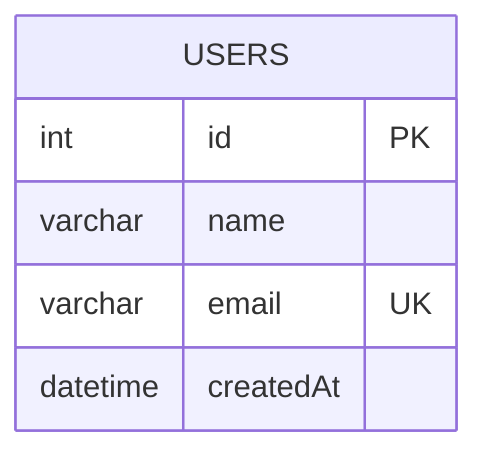

# Modelo de dados

O modelo atual possui uma tabela: `users`.

## 1. Diagrama



## 2. Entity `User`

```typescript
@Entity('users')
export class User {
  @PrimaryGeneratedColumn()
  id!: number;

  @Column()
  name!: string;

  @Column({ unique: true })
  email!: string;

  @CreateDateColumn()
  createdAt!: Date;
}
```

## 3. Campos e restrições

| Campo | Regra |
| --- | --- |
| `id` | Chave primária gerada |
| `name` | Texto obrigatório |
| `email` | Texto único |
| `createdAt` | Data automática |

## 4. Índices

`email` possui unicidade, que normalmente cria uma estrutura de índice. Não
adicione índices sem uma consulta que os justifique.

## 5. Consultas principais

```sql
SELECT * FROM users ORDER BY createdAt DESC;
```

É a consulta usada por `UsersService.findAll`.

## 6. Evolução

Ao adicionar campo:

1. Avalie nullable e valor padrão.
2. Atualize entity.
3. Crie migration.
4. Faça backfill se necessário.
5. Atualize DTO e API.
6. Teste com dados existentes.

Não use `synchronize: true` em produção.

## 7. Privacidade

E-mail é dado pessoal. Restrinja acesso, evite logs desnecessários e avalie
retenção e exclusão conforme a política da organização.

## 8. Checklist

- [ ] Campos possuem regra clara.
- [ ] Chave primária existe.
- [ ] Unicidade está no banco.
- [ ] Índices são justificados.
- [ ] Mudanças possuem migration.
- [ ] Dados pessoais têm proteção.
